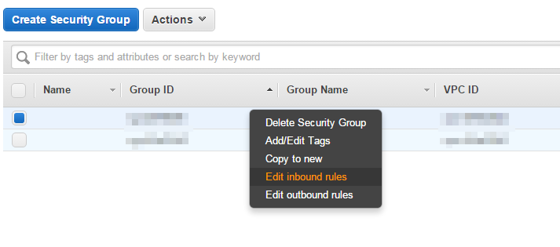
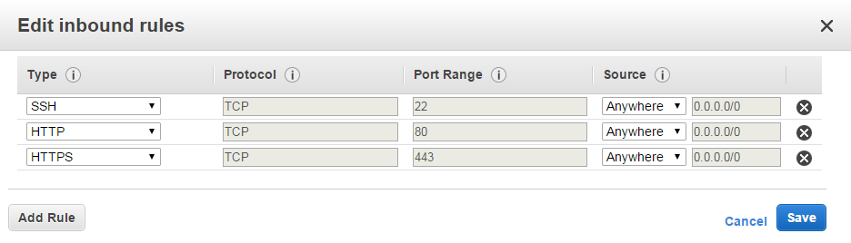

# Amazon EC2
Amazon Web Service(簡稱AWS)現在已經有繁體中文版囉！
>

## 範例目標
架設一個行動應用程式的伺服器環境

##範例流程
1. 啓用Amazon EC2並啟動一個Instance
2. 使用PUTTY登入遠端主機
3. 安裝LAMP環境
4. 安裝phpMyAdmin
5. 使用pscp傳送檔案

##範例說明

使用Amazon Web Service前需要先申請帳號

而申請帳號時需要信用卡資料

所以記得先去辦一張信用卡/金融卡(如VISA、Master Card)

辦帳號的過程很簡單

就把該填的填一填、填完就下一步

經過驗證後就可以開始使用AWS囉

###啓用AWS EC2並啟動一個instance

>

在主選單中選擇EC2，並開始進行設定

本範例使用Amazon Linux

在設定過程中皆選擇預設選項即可

接著比較需要注意的有兩點：

1. key-pair的保存
2. Security Group的設定

####key-pair的保存

在設定過程中會自動下載成一個*.pem的key-pair文件

key-pair可以用來產生private key

有了private key，我們才可以用來進行SSH安全連線

一定要記得保存好，遺失或是被別人拿走網站就完蛋了XD

####Security Group的設定

* 點選Security Groups

>

* 在任一Security Group上點右鍵選擇「Edit inbound rules」，或新增一個

>

Security Group的工作

簡單來說就是門口的警衛

當我們今天想要進入一個晚會(網站)

他們會檢查我們胸前佩戴的名牌(port)，再決定要不要讓你進去

預設的設定是只允許port 22，也就是只允許SSH連線到遠端主機(網站)

這邊我們得額外設定好HTTP(80)和HTTPS(433)，這樣才能從別的地方到我們的網站存取資料，如下圖

>

到這邊為止，就完成EC2 instance的啟動了

### 使用PUTTY登入遠端主機

啟動了EC2之後，就等於我們多擁有了一台空的主機

我們要在這台主機上安裝伺服器環境

這樣之後才可以使用手機來連接伺服器的服務

要登入Amazon EC2需要進行SSH登入

所以以下我們以puttygen與putty為例([至官方網頁下載](http://www.chiark.greenend.org.uk/~sgtatham/putty/download.html))

產生private key並進行安全登入


####使用puttygen產生private key

請拿出我們剛剛下載好的key-pair

並載入到puttygen中，進行產生private key的動作

>圖 puttygen

密碼不需要設定

puttygen下載

#### 使用putty進行安全登入

有了private key之後，我們便可以來進行安全登入

打開putty

>圖 putty介面

選擇左側的Auth，選擇()，載入private key

>圖 auth

回到()，填入遠端主機的資訊

>圖 putty設定

主機位址如果不清楚的話可以進去AWS EC2的主控台中

>圖 EC2 

看要用Public DNS address或Public IP address當主機位址都可以

最後按open，便可連進我們的遠端主機

>圖 remote-terminal

###安裝LAMP環境

成功登入以後，就可以來安裝伺服器環境囉

本範例以LAMP(Linux + Apache + MySQL + PHP)為例，進行伺服器的架設

架設的方法在Amazon上其實就有[詳細的英文說明文件](http://docs.aws.amazon.com/AWSEC2/latest/UserGuide/install-LAMP.html)

而為了方便大家了解，由本範例翻譯成中文：

套件安裝工具yum檔案清單更新
```bahs
$ sudo yum update -y
```

安裝Apache(httpd24)、PHP(php56)、(mysql55-server)、(php56-mysqlnd)
```bash
$ sudo yum install -y httpd24 php56 mysql55-server php56-mysqlnd
```

啟動Apache server
```bash
$ sudo service httpd start

顯示
Starting httpd:                                            [  OK  ]
```

設定Apache server在開機時自動啟動
```bash
$ sudo chkconfig httpd on
```

以下設定使用者的管理權限

建立一個名稱為「www」的群組
```bash
$ sudo groupadd www
```

讓使用者可以管理「www」這個群組
```bash
$ sudo usermod -a -G www ec2-user
```

登出遠端主機，重新SSH登入以完成設定
```bash
$ exit
```

讓群組「www」有管理/var/www資料夾的權限

```bash
$ sudo chown -R root:www /var/www
```

接著對此資料夾中的資料夾(directory)指定權限

```bash
$ sudo chmod 2775 /var/www
$ find /var/www -type d -exec sudo chmod 2775 {} +
```

對此資料夾中的檔案(file)指定權限

```bash
$ find /var/www -type f -exec sudo chmod 0664 {} +
```

虛擬主機伺服器目錄在/var/www/html，建立一個php檔案進行測試
```bash
$ echo "<?php phpinfo(); ?>" > /var/www/html/phpinfo.php
```

打開瀏覽器，輸入php檔案的網址
```bash
http://my.public.dns.amazonaws.com/phpinfo.php
```

>圖 phpinfo頁面

啟動MySQL server

```bash
$ sudo service mysqld start
```

進行安全設定

```bash
$ sudo mysql_secure_installation
```

```bash
$ sudo service mysqld stop
```

設定遠端主機開機時自動啟動MySQL server
```bash
$ sudo chkconfig mysqld on
```


> pscp

### 安裝phpMyAdmin

接著，參考DigitalOcean上由Justin Ellingwood分享的[在CentOS上安裝phpMyAdmin](https://www.digitalocean.com/community/tutorials/how-to-install-and-secure-phpmyadmin-on-a-centos-6-4-vps)

安裝phpMyAdmin到我們AWS EC2的instance上
```bash
$ sudo yum install phpmyadmin
```

打開phpMyAdmin的設定檔，修改一下設定
```bash
$ sudo nano /etc/httpd/conf.d/phpMyAdmin.conf
```

將檔案中與IP address的關的都改成自己的IP address
只允許透過這個IP使用phpMyAdmin管理資料庫
```bash
. . .
Require ip [遠端主機IP位址]
. . .
Allow from [遠端主機IP位址]
. . .
Require ip [遠端主機IP位址]
. . .
Allow from [遠端主機IP位址]
. . .
```

重開Apache server
```
$ sudo service httpd start
```

打開瀏覽器，輸入phpMyAdmin的網址
```
http:/[遠端主機網址]/phpmyadmin
```

>圖 phpMyAdmin

大功告成!可以開始匯入sql檔囉


### 使用pscp傳送檔案

下載pscp

切換到pscp目錄

```bash
cd [pscp.exe存放目錄]
```
傳送本機檔案到遠端主機，需要private key

```bash
pscp -i [private key檔案位址] [本機要傳送的檔案位址] [遠端主機要存放檔案的位址]
```
如果要將整個資料夾傳送到遠端主機，加個-r即可

```bash
pscp -i -r [private key檔案位址] [本機要傳送的資料夾位址] [遠端主機要存放檔案的位址]
```
